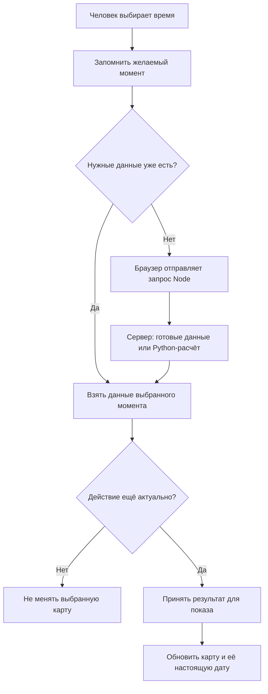
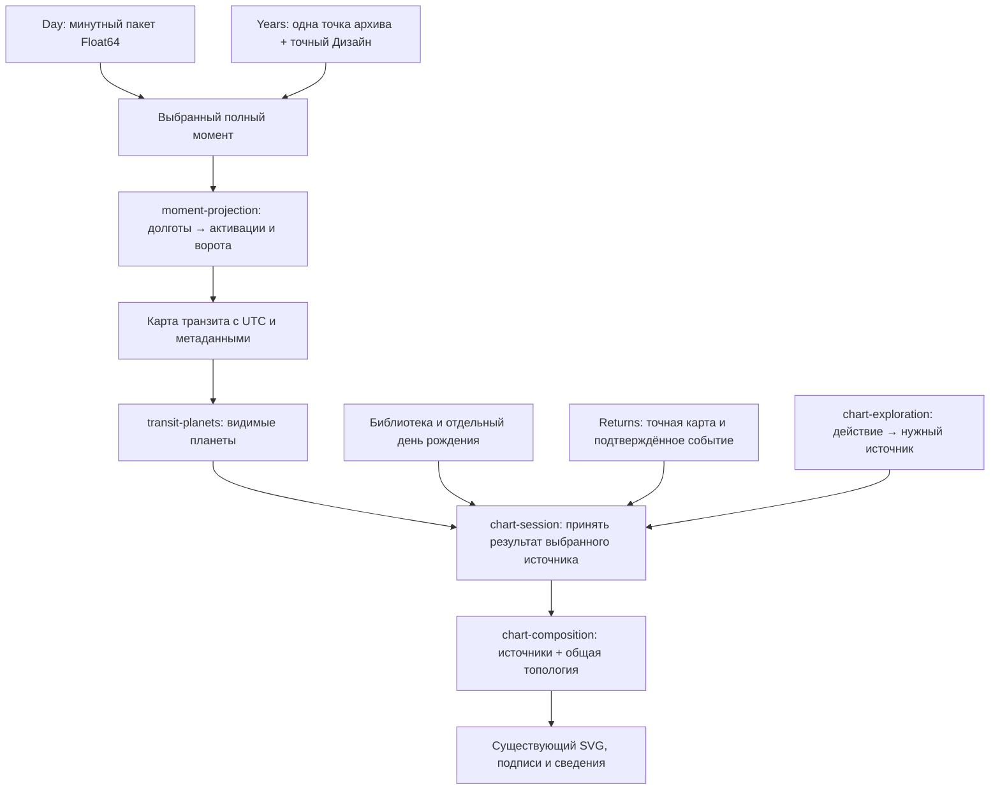

# Форма

«Форма» строит карту Human Design по дате, времени и городу рождения. Здесь можно рассматривать свою карту, двигаться по времени, изучать возвраты планет и читать объяснения элементов рисунка.

Это руководство ведёт от запуска сайта на своём компьютере до понимания его кода. Начните с первых двух разделов. К справочнику форматов и полной карте файлов можно вернуться, когда понадобится конкретное изменение.

## Содержание

1. [Запустить сайт на Mac](#запустить-сайт-на-mac)
2. [Освоить основные действия](#освоить-основные-действия)
3. [Подключить Летопись и Возвраты](#подключить-летопись-и-возвраты)
4. [Понять путь от ползунка до рисунка](#понять-путь-от-ползунка-до-рисунка)
5. [Разобраться в состояниях и сохранении](#разобраться-в-состояниях-и-сохранении)
6. [Найти нужное место в коде](#найти-нужное-место-в-коде)
7. [Изменять, проверять и обновлять проект](#изменять-проверять-и-обновлять-проект)
8. [Точные данные и ограничения](#точные-данные-и-ограничения)
9. [Полная карта проекта](#полная-карта-проекта)

## Запустить сайт на Mac

Локальный запуск означает, что сайт обслуживает ваш компьютер. Браузер показывает страницу, а отдельная работающая программа отвечает на её запросы. Эта программа называется **сервером**.

Сервер Формы написан на JavaScript. **Node.js** выполняет этот JavaScript вне браузера. Для астрономических расчётов сервер запускает **Python**. Если вы знакомы с Django: здесь его нет, входящие запросы принимает программа на Node.

### Если проект уже установлен

Сначала откройте [http://localhost:4176](http://localhost:4176). Если Форма появилась, сервер уже работает: второй запуск не нужен. `localhost` означает «этот компьютер», а `4176` — номер входа к приложению, **порт**. Это адрес в строке браузера, не команда терминала.

Если сайт не открылся:

1. Откройте приложение **Терминал** через поиск Spotlight (`⌘ Space`).
2. Напечатайте `cd ` с пробелом, перетащите папку проекта из Finder в окно терминала и нажмите Enter.

В терминале команды выполняются в текущей папке. `cd` меняет эту папку; перетаскивание подставляет её полный путь. Команды ниже можно копировать по одной и выполнять клавишей Enter.

Проверьте папку:

```sh
pwd
ls package.json requirements.txt README.md
```

`pwd` показывает, где вы находитесь. Вторая команда должна перечислить три файла без ошибки. Это **корень проекта**: папка, внутри которой находятся `src`, `server`, `public` и остальные части приложения. Далее все команды выполняются отсюда, если явно не сказано иначе.

Запустите:

```sh
npm start
```

`npm` поставляется вместе с Node.js. Здесь он читает команду `start` из `package.json` и запускает сервер. Дождитесь строки `Форма: http://localhost:4176/`, затем откройте этот адрес. Терминал останется занят сервером — это нормально. Закрытие вкладки браузера сервер не останавливает.

Чтобы остановить **этот запуск**, вернитесь в его терминал и нажмите `Ctrl+C`. Появится обычная строка ввода команд. Для следующего запуска снова достаточно перейти в ту же папку и выполнить `npm start`. Если сервер был запущен другим приложением, останавливать его нужно там, где он был запущен: `Ctrl+C` в новом пустом терминале на него не влияет.

Без отдельно подключённого архива работают создание карт, библиотека и исследование дня. Длинная Летопись и личная шкала Возвратов подключаются [позже](#подключить-летопись-и-возвраты); они не нужны для первого знакомства.

### Если это новый компьютер или новая копия проекта

Нужно один раз получить исходники и установить программы, от которых они зависят. **Исходники** — читаемые файлы проекта. **Зависимости** — готовые чужие библиотеки, которые проект использует, например для астрономии или сборки браузерных файлов.

#### 1. Установить Node.js

Установите **Node.js ветки 24 LTS** с [официальной страницы Node.js](https://nodejs.org/en/download/): выберите macOS и установщик `.pkg`. LTS — ветка с длительной поддержкой. После установки откройте новое окно терминала.

Проверьте Node и npm:

```sh
node --version
npm --version
```

Ожидается `v24.…` у Node и номер версии npm. Если видите `command not found`, программа недоступна этому терминалу: проверьте установку и откройте новое окно.

#### 2. Получить файлы проекта

Для получения и обновления исходников нужен **Git**. Он сохраняет версии файлов; **GitHub** хранит их удалённую копию.

```sh
git --version
```

Если macOS предложит установить инструменты разработчика, завершите установку и повторите команду. Должен появиться номер версии Git. Затем получите проект в новую папку:

```sh
mkdir -p ~/Projects
cd ~/Projects
git clone --branch main https://github.com/JMahach/forma.git
cd forma
```

`~` обозначает вашу домашнюю папку. `mkdir -p` создаёт папку `Projects`, если её ещё нет. `git clone` скачивает исходники вместе с историей изменений. **Ветка** — именованная последовательность версий: эта инструкция использует `main`. Если папка `forma` уже существует, не удаляйте её ради повторного клонирования: используйте имеющийся проект либо выберите новое имя папки. Если GitHub просит доступ, войдите в аккаунт, которому доступен репозиторий.

#### 3. Подготовить Python

Для новой установки используйте **Python 3.11**. Для закреплённой версии [pyswisseph 2.10.3.2](https://pypi.org/project/pyswisseph/2.10.3.2/#files) опубликован готовый пакет под macOS и Python 3.11. Нельзя автоматически считать любую более новую версию Python совместимой: например, для 3.12 такого готового пакета этой версии нет.

Один путь установки — [Homebrew](https://brew.sh/), программа для установки инструментов. Его установщик `.pkg` рассчитан на **Apple Silicon — процессоры серии M**. Для Intel Mac или старой macOS сначала сверьтесь с [актуальными требованиями и способом установки](https://docs.brew.sh/Installation): тот же `.pkg` для них не подходит.

На подходящем Mac установите Homebrew, выполните указанные установщиком завершающие шаги и откройте новый терминал. Команда `brew --version` должна вывести версию.

Установите Python и проверьте его:

```sh
brew install python@3.11
"$(brew --prefix python@3.11)/bin/python3.11" --version
```

`brew --prefix` находит место установки, поэтому не нужно угадывать путь для Intel или Apple Silicon. Ожидается `Python 3.11.…`. Затем снова перейдите в корень нового клона, если открыли другое окно терминала.

Создайте **виртуальное окружение**: отдельную папку Python и его библиотек для этого проекта. Благодаря ей зависимости Формы не смешиваются с другими Python-проектами. В чистом клоне папки `.venv` ещё нет. Если она уже есть или скопирована из другого проекта, не выполняйте создание поверх неё: используйте новый клон без чужой среды, сохранив старую рабочую папку.

```sh
"$(brew --prefix python@3.11)/bin/python3.11" -m venv .venv
.venv/bin/python -m pip install --only-binary=:all: -r requirements.txt
```

Первая команда создаёт `.venv`. Вторая устанавливает перечисленные в `requirements.txt` версии библиотек именно в неё. `--only-binary=:all:` требует готовые пакеты: если подходящего нет, установка остановится вместо неявной сборки из исходников. `pip` — установщик библиотек Python. Отдельно активировать окружение не требуется: команды явно указывают `.venv/bin/python`, и сервер использует тот же путь.

Путь с Python 3.11 основан на опубликованных пакетах и инструкциях установки; полный запуск на чистом новом Mac ещё не проверен. Проверенное существующее окружение — macOS 15.7.7 на Apple Silicon, Node 24.18.1 и Python 3.9.6. В новом клоне `.venv` создают заново: готовое окружение с другого компьютера не является переносимой частью проекта.

#### 4. Установить библиотеки Node и запустить сайт

Установите зависимости Node:

```sh
npm ci
```

Команда читает точные версии из `package-lock.json` и создаёт `node_modules`. `ci` здесь — название команды установки: она подходит и для локального компьютера. При обновлении зависимостей она пересоздаёт `node_modules`, но не удаляет ваши исходники и карты браузера.

Проверьте Python и запустите сервер:

```sh
.venv/bin/python -c "import swisseph, tzdata; print('Python dependencies OK')"
npm start
```

Должны появиться `Python dependencies OK` и затем адрес Формы. Города и эфемериды — числовые данные для расчёта положений небесных тел — уже входят в исходники. Базу данных вроде PostgreSQL отдельно устанавливать не требуется.

Откройте страницу, создайте пробную карту по инструкции следующего раздела. Само появление страницы подтверждает работу Node; успешный расчёт дополнительно проверяет связь с Python.

### Если запуск не получился

| Что видно | Что это означает и что сделать |
| --- | --- |
| Нет `package.json`, ошибка `ENOENT` при `npm start` | Терминал находится не в корне проекта. Проверьте `pwd` и перейдите в папку с `package.json`. |
| `npm: command not found` | Node/npm не установлены либо новое окно терминала ещё не открыто после установки. |
| Не найден `.venv/bin/python` или модуль `swisseph` | Не создана среда Python либо не установлены `requirements.txt`. Вернитесь к установке в этой копии проекта. Сервер использует именно её, а не произвольный Python из системы. |
| `brew: command not found` | Homebrew не установлен или не выполнены его завершающие шаги настройки терминала. Проверьте инструкцию установщика и новое окно терминала. |
| pip сообщает, что подходящий пакет не найден | Проверьте `.venv/bin/python --version`, доступ к PyPI и поддержку вашей системы. Инструкция ожидает Python 3.11 и готовые пакеты; удалять ограничение ради непроверенной сборки автоматически не нужно. |
| `EADDRINUSE` и порт `4176` | Этот порт уже занят. Откройте сайт: возможно, нужный сервер уже работает. Остановите свой прежний запуск через его терминал. Не завершайте все процессы Node на компьютере. |
| Страница открылась, но расчёт завершился ошибкой | Проверьте команду импорта Python выше и сообщения терминала. Затем данные рождения: город нужно выбрать из найденных вариантов. |
| Ошибка архива при запуске | Указан неправильный путь, отсутствуют соседние метаданные или архив несовместим. Для базового запуска без архива используйте `env -u FORMA_LIFETIME_CORPUS npm start`. |
| Ошибка `dist`/`manifest` в release-режиме | Сначала выполните `npm run build`; обычный `npm start` сборки не требует. |

Если нужно намеренно использовать другой порт:

```sh
PORT=4177 npm start
```

Тогда адрес — `http://localhost:4177`. **У другого адреса будет отдельное хранилище браузера:** прежняя библиотека на 4176 от этого не удалится, но автоматически на 4177 не появится.

### Открыть с телефона

По умолчанию сервер принимает соединения через сетевые интерфейсы компьютера и печатает доступные адреса. Подключите телефон и Mac к одной сети Wi-Fi и откройте на телефоне напечатанный адрес вида `http://192.168.…:4176`. `localhost` на телефоне означает сам телефон, а не Mac. Между устройствами также должны разрешаться соединения в сети и брандмауэре.

Библиотека карт телефона будет отдельной. Для запуска только на самом Mac можно указать `HOST=127.0.0.1 npm start`. `HOST` и `PORT` — настройки процесса, переданные перед командой; они действуют для этого запуска. Файл `.env` приложение само не читает.

## Освоить основные действия

### Сначала осмотреть текущий момент

В меню слева выберите **Транзит**. Это положения небесных тел в выбранный момент времени, без привязки к вашему рождению.

Подвигайте дневную шкалу: рисунок и дата покажут выбранный момент. Чтобы снова следовать часам, нажмите отметку текущего времени на шкале; её подсказка — «Вернуться к текущему времени». На активной видимой странице текущий момент обновляется поминутно. При ошибке загрузки появляется кнопка **Повторить**.

Рисунок с центрами и соединениями называется **бодиграфом**. Кнопка **Мандала** показывает ту же карту с круговой разметкой. Переключение вида не меняет исходные данные. Перетаскивайте рисунок для перемещения, используйте приближение и кнопку **Вся схема**, чтобы снова вместить его на экран. На сенсорном экране перемещение и приближение работают жестами.

Попробуйте три разных действия:

| Действие | Что изменится |
| --- | --- |
| Навести указатель на ворота, канал, центр или планету | Появится временная подсветка. |
| Нажать на элемент | Выбор закрепится, появятся сведения о нём. С `Shift` можно добавлять или убирать части выбора. |
| Снять галочку у планеты | Из показанной схемы уберётся её вклад. Если она была последним источником активации ворот, ворота и связанный канал могут исчезнуть. |

Галочки работают с уже полученными числами. Полные исходные строки остаются в памяти: включение планеты возвращает её без нового астрономического расчёта. Перемещение и приближение рисунка меняют только видимую область; далее это называется **камерой**.

**О карте** открывает сводку показанных данных. **Библиотека** в меню — справочник элементов карты. В разделе **Мои карты** находятся ваши сохранённые личные карты.

### Создать свою карту

1. В разделе **Мои карты** нажмите **Новая карта**.
2. Введите имя, дату и местное время рождения.
3. Найдите город и выберите его из предложенного списка. Программе нужен его часовой пояс, а не только набранный текст.
4. Нажмите **Рассчитать и сохранить** и дождитесь результата.

Рассчитанная карта появится в библиотеке **этого браузера**. Она хранит и данные рождения, и готовый результат. Поэтому при следующем выборе из списка не требуется заново считать рождение. В ручном режиме можно задать ворота самостоятельно: такая карта не означает, что выполнен расчёт по дате, и не даёт все инструменты рассчитанной личной карты.

Обычный выбор рассчитанной карты открывает **Шкалу дня**. Двигайте время, чтобы увидеть, как выглядела бы карта при другом времени рождения в этом дне. Сохранённое рождение от движения ползунка не меняется. Нажмите отметку исходного рождения на шкале: её подсказка — «Вернуться к сохранённому времени рождения». Она вернёт первоначальную карту. В обычном состоянии это отметка шкалы, а при ошибке отдельная кнопка предлагает **Повторить** загрузку.

### Изменить или удалить сохранённую карту

Откройте **⋯** у карты в меню **Мои карты**, выберите **Редактировать**, внесите изменения и нажмите **Рассчитать и сохранить**. Для ручной карты кнопка называется **Сохранить карту**.

Если вы меняете только имя или заметку, программа использует прежний расчёт. Новое имя появится в списке и подписи выбранной карты. Подтверждённый исследуемый момент сохранится. Само открытие формы закрывает список возвратов и отменяет ещё незавершённый выбор события.

Чтобы удалить запись, откройте её **⋯ → Удалить** и подтвердите удаление в появившемся окне. Если хранилище не позволило записать удаление, программа сообщит об ошибке и оставит карту в библиотеке. Если удалена показанная карта, выбирается другая личная карта либо Транзит.

### Цвета и дополнительные возможности

У одиночной карты чёрная сторона — **Личность**, положения на рассматриваемый момент; красная — **Дизайн**, положения в специально найденный более ранний момент. Его ищут по Солнцу на 88 градусов раньше, а не вычитают 88 календарных дней.

Сводка линий в **О карте** считает показанные стороны Личности и Дизайна: столбцы, общая сумма и выделяемые ворота относятся к тем же данным, которые вы видите.

В личном **наложении** цвета обозначают происхождение двух карт: исходный натал красный, добавленный возврат или транзит чёрный. Личность и Дизайн внутри каждого источника всё равно остаются различимыми в данных и сведениях. Слово «натал» здесь означает исходную карту рождения. Выбор и сравнение двух произвольных людей как отдельная функция пока не реализованы.

В меню есть **Счётчик FPS** — диагностическая панель частоты обновления кадров и пауз. Она помогает заметить проблемы движения; её числа сами по себе не доказывают скорость всех расчётов.

На [странице `/love`](http://localhost:4176/love) находится отдельная история «Четыре грани любви» о воротах Креста Сосуда Любви. Это тематический материал с собственным рисунком, а не другая страница вашей текущей личной карты. При изменённом порте используйте тот же путь `/love` на своём адресе.

## Подключить Летопись и Возвраты

**Летопись** позволяет уйти далеко за пределы одного дня. Для этого сервер читает заранее подготовленные положения планет с диска. Такой файл называется **архивом**: он содержит данные 1801–2399 годов и занимает около 2,77 ГБ. Браузер получает только нужные точки, а не скачивает весь файл.

Архив не входит в Git. Если он уже есть, нужны оба файла: бинарный `.f64le` и соседний файл с тем же основанием имени и окончанием `.metadata.json`. Второй описывает диапазон, формат и контрольные сведения первого. Держите их рядом.

Остановите свой обычный запуск через `Ctrl+C` и запустите с архивом:

```sh
FORMA_LIFETIME_CORPUS="/полный/путь/lifetime-1801-2400.f64le" npm start
```

Замените путь внутри кавычек на путь к вашему существующему файлу; пример буквально не запускайте. Можно вставить путь перетаскиванием файла из Finder. Эта настройка не запоминается командой `npm start`: для повторного запуска с архивом повторяйте полную команду. Если путь был отдельно задан через `export` в текущем терминале, он сохраняется в его окружении до отмены или закрытия окна.

Если архива нет, его можно подготовить один раз из корня проекта:

```sh
.venv/bin/python -m server.python.lifetime_archive \
  --file .cache/lifetime/lifetime-1801-2400.f64le --workers 3
```

Это длительный расчёт и запись большого файла, а не обязательная часть установки. Обеспечьте свободное место и дождитесь завершения команды; не используйте частично созданный архив. Три `workers` означают до трёх параллельных исполнителей этой подготовки. После успешного завершения:

```sh
FORMA_LIFETIME_CORPUS=.cache/lifetime/lifetime-1801-2400.f64le npm start
```

При запуске архив проверяется. Несовместимый или повреждённый файл останавливает запуск; приложение не заменяет его незаметно новым. Параметры подготовки можно посмотреть без расчёта командой `.venv/bin/python -m server.python.lifetime_archive --help`.

### Как исследовать длинную шкалу

В Транзите откройте **Летопись**. Сначала она может использовать уже загруженный сегодняшний день. Выбор другого диапазона подключает архив; конечная дата включается целиком. В готовом совместимом дневном пакете доступны минуты, например 12:01. В остальных датах обычное движение использует архивный шаг 10 минут.

У рассчитанной личной карты есть две кнопки с названием **Возвраты**:

| Где находится кнопка | Что она открывает |
| --- | --- |
| В верхней панели | Личную шкалу от точного рождения до столетия либо границы доступного архива. Обычное включение начинает просмотр в рождении; повторное нажатие выключает этот режим. |
| Над открытой личной шкалой | Список событий: основные этапы, выбранный год или одну планету. |

**Возврат** — рассчитанный момент, когда выбранное небесное тело достигает положения, связанного с исходной картой. Для каждого цикла список и отметки показывают первый точный проход; повторные ретроградные проходы остаются в расчётных данных. Выберите строку или отметку: готовая карта события накладывается на натальную. У неё своё точное время и свой Дизайн, без округления к архивной сетке.

Между событиями ползунок показывает натал с транзитом выбранного времени. Для возвращения к знакомой точке:

- **Рождение** в списке возвращает исходную карту.
- **Сейчас** в списке накладывает текущий транзит на этот же натал и включает следование часам.
- Эти же моменты выбираются своими отметками на личной шкале.
- **Шкала дня** в верхней панели завершает просмотр возврата и возвращает исходный момент.

Пункт **Транзит** в главном меню открывает самостоятельную карту транзита, без личного натала. Закрытие только списка возвратов оставляет уже подтверждённое событие на карте; ещё незавершённый выбор события при закрытии отменяется.

На компьютере список находится сбоку, на телефоне открывается снизу. Ошибка загрузки и повторная попытка относятся к тому действию, которое не получилось. Пока следующий момент загружается, прежняя карта сохраняет свою настоящую дату.

## Понять путь от ползунка до рисунка

Представьте: в библиотеке хранится рождение Анны. На личной шкале вы выбрали другую дату. Программа должна исследовать эту дату, сохранив рождение Анны. Поэтому она отдельно помнит исходную карту, желаемый момент и уже показанный результат.

У браузера и сервера разная работа. **Браузер** выполняет JavaScript страницы: обрабатывает нажатия, выбирает готовые числа и рисует.

**Сервер на Node** работает вне страницы, принимает её сообщения и при необходимости запускает Python с астрономической библиотекой Swiss Ephemeris. При локальном запуске всё это находится на одном Mac. При публичном запуске Node и Python работают на серверном компьютере, а браузер — у посетителя сайта.

Например, показано 12:00, а вы попросили 12:10. Пока для 12:10 нет данных, карта и её подпись остаются на 12:00. Ползунок уже может обозначать новую цель. Когда данные пришли, программа проверяет, нужен ли этот ответ ещё. Если вы тем временем выбрали Бориса, результат для Анны не заменит его карту. Если выбор прежний, рисунок и сведения переходят к новому принятому моменту.

Посмотрим, откуда берутся числа для этого перехода.

1. **Кнопка или шкала принимает действие.** Код рядом с ней сообщает программе выбранное время. Эти части находятся в `src/views/`: они работают с элементами страницы и подписями.
2. **Программа запоминает цель и определяет нужные данные.** Обычный день содержит минуты; Летопись знает диапазон и допустимые точки. Это работа соответствующей части `src/state/`. Английское state означает состояние: сведения о том, что выбрано, что готово, чего ждём.
3. **Если нужная минута уже загружена, она берётся на компьютере.** Полный пакет дня — это массив чисел сразу для его минут. Положение небесного тела представлено долготой — углом на круге от 0 до 360°. Не надо обращаться к серверу на каждое движение. Часть `src/domain/` переводит выбранные долготы в активации: записи о планете, её воротах и линии.
4. **Если точки нет, браузер спрашивает сервер.** Например: «пришли числа для этого момента». Такой обмен называется HTTP-запросом. Адреса и правила этих запросов образуют API приложения — способ общения программы с программой. Код `src/data/` отправляет параметры и получает ответ. Node принимает запрос, проверяет его и направляет расчётчику или к уже сохранённым данным. Python рассчитывает нужную астрономию. Для обычной архивной точки часть долгот читается из архива, а её Дизайн рассчитывается точно.
5. **Ответ проверяется и принимается для показа.** Проверяется не только состав чисел, но и актуальность действия. `chart-session` хранит уже принятый результат. Остальные части не должны самостоятельно подменять его своими поздними ответами.
6. **Рисунок обновляется по готовым данным.** `src/scene/` меняет существующие элементы изображения: цвет, подписи, положения. Браузерный рисунок сделан в формате SVG — это набор линий, фигур и текста, а не одна фотография. Поэтому изменение времени не требует заново создавать всю картинку.



Вот сокращённый пример одной активации:

```json
{ "planet": "sun", "longitude": 302, "gate": 41, "line": 1 }
```

`planet` — небесное тело (здесь Солнце), `longitude` — его угол, `gate` — номер ворот, `line` — линия внутри ворот. Для учебного угла 302° текущая функция `gatePositionAtLongitude` действительно выдаёт ворота 41 и линию 1. Это пример преобразования числа, а не утверждение о положении Солнца в какой-либо конкретный день.

Сохранение готовых данных для повторного использования называется **кэшем**. Например, возврат к уже просмотренной минуте может взять прежние числа. Цена такого решения — память, проверка совместимости и ограничение количества записей. Поэтому у каждого кэша есть предел: приложение не накапливает все когда-либо просмотренные даты.

Приближение, выбор ворот и фильтр планет работают иначе: нужные числа уже есть, меняется представление. Отправлять их ради этого заново в Python было бы лишней работой.

## Разобраться в состояниях и сохранении

### Что именно программа различает

**Состояние** — то, что программа помнит о текущей работе. В примере с Анной в него входят несколько разных сведений:

| Что запомнено | Пример | Зачем отдельно |
| --- | --- | --- |
| Исходная карта | Анна, её рождение и готовый расчёт | Шкала не должна переписывать биографические данные. |
| Запрошенный момент | Хочу посмотреть 12:10 | Запрос может ещё выполняться или завершиться ошибкой. |
| Принятый показанный результат | На экране пока карта 12:00 | Подпись должна соответствовать реальному рисунку, а не обещанному ответу. |
| Открытые инструменты | Личная шкала открыта, список возвратов закрыт | Закрытие списка не обязательно отменяет показанное событие. |
| Вид рисунка | Мандала включена, масштаб увеличен | Камера и оформление не являются новым расчётом рождения. |

Когда показываются сразу две карты, программа хранит ссылки на обе и отдельно получает их общие ворота и каналы. Этот собранный результат называется **композицией**. Исходные активации остаются при своих картах, поэтому можно узнать, откуда взялась каждая линия. Общая схема связей ворот и центров называется **топологией**.

### Что переживает перезагрузку

| Где лежат данные | Что это | Что сохраняется |
| --- | --- | --- |
| `localStorage` браузера | Небольшие постоянные записи: библиотека личных карт | Обычно переживают закрытие и повторное открытие браузера, пока его данные не очищены. |
| `sessionStorage` вкладки | Положение страницы: выбранная карта, время, фильтры, камера, открытые/закрытые инструменты | Восстанавливается при обновлении этой вкладки. Новая независимая вкладка не является продолжением её состояния; восстановление закрытых вкладок зависит также от браузера. |
| Память программы и IndexedDB | Готовые расчётные пакеты для повторного использования; IndexedDB — отдельное хранилище браузера для таких данных | Кэш может быть удалён или вытеснен. Приложение должно получить расчётные данные заново. |
| Файлы сервера | Исходники, города, эфемериды, необязательный большой архив и дисковый кэш транзита | Находятся на компьютере, где запущен Node. Перезапуск сервера не стирает библиотеку в браузере. |

Браузер разделяет данные по адресу сайта и профилю пользователя. `http://localhost:4176`, `http://127.0.0.1:4176` и адрес с другим портом — разные места хранения. Другой браузер или телефон тоже не получает ваши карты автоматически. У проекта нет аккаунтов, облачной синхронизации и встроенного экспорта резервной копии библиотеки. Копирование папки проекта или отправка в Git сохраняет код, но не личные карты. Не очищайте данные сайта, рассчитывая восстановить библиотеку из кэша.

При двух вкладках изменение одной карты сохраняется отдельно от других. Старая вкладка не должна перезаписать всю библиотеку своим устаревшим списком. При одновременном редактировании одной и той же карты действует последняя завершённая запись. Повреждённые записи и отказ хранилища показываются как ошибки; кэш не служит резервной копией пользовательских данных.

### Как возвращается положение страницы

Предположим, вы открыли карту Анны, выбрали её возврат Сатурна, закрыли список событий и приблизили рисунок. После обновления страницы нужно снова показать тот же возврат Анны, с закрытым списком и прежним приближением.

Для этого вкладка сохраняет выбранную карту, время, инструменты и вид. Карта узнаётся по **ID** — внутреннему уникальному обозначению записи. Имени для этого недостаточно: двух людей может одинаково звать Анна. Закрытая шкала тоже имеет сохранённое значение — «закрыта». Открывать её просто потому, что страница загрузилась заново, нельзя.

При обновлении страницы прежняя рабочая память JavaScript исчезает. Программа читает сохранённые настройки, находит исходную карту в библиотеке и получает расчёт выбранного момента: из подходящего кэша или с сервера. Затем снова собирает показанный результат. Поэтому восстановление иногда требует ожидания, хотя сам выбор времени уже известен.

В снимок вкладки входят ID исходной карты, камера и Мандала, видимые планеты, параметры дня и Летописи, фильтры списка и подтверждённое событие. Внутренние `owner` и `accepted` восстанавливаются по этим сведениям: первое определяет, от какого инструмента сейчас допустим результат, второе хранит уже принятый результат. Их целиком в снимок не записывают. Закреплённые выделения и временное наведение также не сохраняются для перезагрузки.

**UTC** позволяет обозначить один и тот же момент независимо от местных часов. Например, строка `1990-06-15T10:31:00Z` означает 10:31 UTC; город и дата позволяют перевести её в местное время. Поэтому сохранённый момент можно восстановить однозначно.

**Почему в коде два вызова восстановления?** Сейчас работа поделена между двумя частями:

| Вызов | Его работа |
| --- | --- |
| `view-session.restore()` | Прочитать сохранённый выбор, выбрать Анну, вернуть вид, восстановить инструменты и запросить недостающий расчёт. Пока ответа нет, сохранить цель для ожидания или повторной попытки. |
| `exploration.finishRestore()` | Согласовать личный режим с тем, что удалось вернуть: нужный источник карты, отметки событий, следование часам. Если сохранённое событие отклонено, вернуть исходную карту; обычный день открыть лишь при подходящих условиях, учитывая сохранённое закрытие. |

В примере с успешно восстановленным возвратом первый вызов получает его точную карту, второй согласует с ней личную шкалу и отметки. Два вызова сами по себе не означают два одинаковых запроса расчёта. Защита от устаревших ответов — отдельное правило, она не является причиной такого разделения.

Соединяет оба вызова `src/app.js`. До них он готовит допустимый личный диапазон `savedLife`: от рождения выбранного человека в пределах доступного срока. Второй вызов стоит в `finally` — блоке JavaScript, который выполняется и после успеха, и после ошибки первого.

Это граница нынешней реализации: единого внешнего вызова, включающего обе части, сейчас нет. При изменении восстановления нужно учитывать их порядок и сохранение незавершённой цели.

**Если человек выбрал другое во время ожидания**, приоритет у нового выбора карты, момента или диапазона. Простое движение камеры, нажатие Tab или открытие вспомогательной панели такой командой не считается.

Для защиты от старых ответов инструменты меняют номер текущей работы и сверяют с ним пришедший ответ. В коде эти проверки называются `generation`, `valid`, токен открытия. Смысл один: «мы всё ещё ждём именно это?» Отмена запроса браузером может не остановить уже запущенный Python сразу, но его старый результат не должен изменить новый выбор.

## Найти нужное место в коде

В JavaScript **модуль** — файл, который предоставляет функции другим файлам. `import` подключает нужные функции, `export` делает их доступными. Функции создания, например `createChartSession`, возвращают объект с командами и текущими значениями; они не создают отдельный сервер или поток.

Слово **владелец** ниже означает место, где принимается конкретное решение и хранится его изменяемое состояние. Например, «какая карта сейчас показана» должно иметь один ответ. Если каждая панель будет выбирать его сама, дата одной панели и рисунок могут разойтись.

| Вопрос при изменении | Где находится ответ | Что соседние части делают вместо него |
| --- | --- | --- |
| Какое действие выполняет кнопка? | `src/views/` принимает нажатие; `src/app.js` связывает его с командой | Форма и шкала показывают значения, ожидание и ошибку. |
| Как перейти к Дню, рождению или другой шкале? | `src/state/chart-exploration.js` задаёт последовательность переключения | Каждый инструмент хранит свой диапазон и свою загрузку. |
| Какую карту выбрали и какой результат уже принят? | `src/state/chart-session.js` | Рисунок читает готовый результат, а не выбирает его из нескольких конкурирующих инструментов. |
| Какой момент считает конкретный инструмент? | `live-transit.js`, `natal-day.js`, `lifetime.js`, `returns.js` в `src/state/` | `src/data/` доставляет данные и повторно использует готовые ответы. |
| Где личные карты и где снимок вкладки? | `src/data/chart-store.js`/`storage.js` и отдельно `view-store.js` | `view-session.js` возвращает снимок страницы, не перезаписывая библиотеку. |
| Как из долготы получается номер ворот? | `src/domain/` | Рисунок использует вычисленные значения; формулу в нём не повторяют. |
| Где цвет, геометрия и движение? | Палитра наложения — `src/domain/chart-overlay.js`; применение цветов и движение — `src/scene/`; координаты — `src/scene/geometry/` | Расчёт планет не знает, где на экране нарисован центр. |
| Кто считает положения планет? | `server/python/astronomy.py` и вызывающие расчётные файлы | Node принимает HTTP, ограничивает очередь и запускает Python через `server/runtime/`. |

Такое разделение позволяет, например, поменять цвет без изменения расчёта или правило возврата без переписывания жестов. Цена — необходимость понимать связи файлов. Поэтому `app.js` остаётся явным местом соединения: там видно, какая функция передаётся в какую часть.

Вызов функции позже по событию называется **callback**. Например, `onSelect` — функция, которую вызывают после выбора. Передача такого уведомления назад другой части не означает повторный выбор. При явном выборе карты нужно открыть День, а при восстановлении — вернуть сохранённый режим; оба пути используют общую безопасную смену карты.

### С чего начинается работа страницы

При обычном локальном запуске путь такой:

1. `npm start` запускает `server/server.mjs` — вход в серверную программу.
2. Вы открываете адрес сайта. Сервер отдаёт страницу на основе `public/index.html`. **HTML** описывает элементы страницы: кнопки, панели и место для рисунка.
3. В этой странице указан `src/startup.js`; браузер начинает выполнять его JavaScript. Он читает сохранённый выбор и готовит начальную загрузку. Например, сегодняшний транзит не нужно заранее запрашивать для страницы с сохранённым личным возвратом.
4. `startup.js` подключает `app.js` и вызывает `startApp()`. Эта функция создаёт части приложения и связывает их, используя уже прочитанный выбор.

Слово **контроллер** в именах означает объект, управляющий конкретным инструментом: он принимает команды, помнит состояние и сообщает об изменениях.

### Что общее у шкал

У дневного транзита, дня рождения и Летописи общий обработчик движения и нажатий — `src/views/timeline-range.js`. Поэтому работу с ползунком не приходится заново писать для каждой шкалы.

Сами данные различаются. День рождения должен учитывать местные часы и точное исходное рождение; транзит может следовать текущим часам; Летопись работает с большим диапазоном архива. У этих задач свои владельцы в `src/state/`. Общие правила перевода чисел в карту вынесены в `src/domain/`.

Шаг определяется доступными данными: готовый совместимый день даёт минуты, архив — обычный шаг 10 минут. Точный момент рождения или возврата сохраняет свою точность. Общее управление шкалами не заставляет округлять все источники одинаково.

### Что остаётся на сервере

На сервере тоже есть три понятные обязанности. `server/http/` разбирает запрос и оформляет ответ. `server/services/` проверяет данные, повторно использует результат и ставит расчёт в очередь. `server/python/` выполняет вычисления. **Очередь** нужна, чтобы множество запросов не запустило одновременно неограниченное число тяжёлых процессов. Подробные файлы перечислены [в конце](#полная-карта-проекта).

## Изменять, проверять и обновлять проект

### Небольшой рабочий цикл

Оставьте запущенный сервер в его терминале. Для правок, тестов и Git откройте **второе окно терминала** и перейдите в корень проекта. Дальнейшие команды выполняйте там; возвращайтесь в первое окно только для остановки или перезапуска сервера.

1. Откройте корень проекта в редакторе кода. Найдите поведение в таблице выше и прочитайте ближайшие связанные функции.
2. Сформулируйте конкретный результат: например, «после закрытия списка выбранный возврат остаётся на карте».
3. Измените соответствующее место. Если исправляете ошибку, сначала воспроизведите её и добавьте проверку именно этого сценария.
4. Проверьте результат и соседние действия. Не ограничивайтесь успешным первым нажатием: смените карту во время загрузки, повторите действие, обновите вкладку.
5. Обновите этот README, если изменились запуск, поведение, форматы данных или распределение обязанностей.

В обычном запуске Node выдаёт исходные браузерные файлы. После правок JS/CSS обновите страницу браузера. При изменении серверного JavaScript, Python или расчётных данных остановите сервер и запустите снова: работающий процесс может держать старый код, подготовленные версии и кэш. Сборка для каждого небольшого изменения при `npm start` не обязательна.

Например, вы хотите проверить правило «закрытие списка оставляет выбранный возврат на карте». Начните с `close()` в `src/state/returns.js`: это владелец закрытия списка. В `tests/returns-state.test.mjs` есть сценарии закрытия после готового результата и во время ожидания ответа. **Тест** — небольшой код, который выполняет действие и проверяет ожидаемый результат. Здесь важно проверить оба случая: готовое событие остаётся, незавершённый выбор отменяется.

Чтобы запустить только эти проверки:

```sh
node --test tests/returns-state.test.mjs
```

Так путь поиска становится конкретным: наблюдаемое действие → его владелец → проверка этого правила. Для изменения внешнего вида списка начальным файлом будет уже `src/views/returns-panel.js`.

### Проверки

Из корня проекта:

```sh
npm test
npm run test:python
```

Первая команда проверяет JavaScript и связанные сценарии, вторая — расчёты Python. Успешное завершение означает отсутствие проваленных проверок (`fail 0` у JavaScript, `OK` у Python). Часть проверок HTTP в обычном запуске тестов пропускается намеренно: им нужен уже работающий сервер.

Для проверки настоящих ответов сервера оставьте его работающим на 4176 и откройте второй терминал в корне проекта:

```sh
RUN_API_TESTS=1 API_TEST_BASE_URL=http://127.0.0.1:4176 node --test tests/api.test.mjs
```

Эта команда проверяет обмен с приложением, включая расчёт пробных данных. Она не создаёт записи в библиотеке вашего браузера. Проверки JS/Python/HTTP не заменяют ручной просмотр: отдельно проверьте рисунок, мышь, касания, узкий экран, ожидание и восстановление выбранного момента.

### Исходники и сборка

Для обычной разработки используется `npm start`. Для выдачи подготовленных браузерных файлов есть **сборка**: инструмент объединяет и уменьшает нужные файлы, создаёт варианты сжатия и кладёт результат в `dist`.

```sh
npm run build
```

После успешного завершения остановите прежний запуск на том же порту и выполните:

```sh
npm run start:release
```

Адрес по умолчанию остаётся 4176. При необходимости архива передайте `FORMA_LIFETIME_CORPUS` и здесь. В этом режиме сервер использует `dist`; после изменений исходников нужна новая сборка. Одной папки `dist` недостаточно для приложения: API всё ещё требует Node, Python, серверный код и данные.

### Git и обновление

**Коммит** — сохранённый в Git снимок изменений с описанием. **Push** отправляет его в GitHub. Это помогает сохранить исходники и передать их другому разработчику, но не переносит личные карты из браузера и не обновляет работающий публичный сервер.

Перед изменениями и перед сохранением посмотрите:

```sh
git status
git diff
```

Первая команда показывает изменённые и новые файлы; вторая — содержание уже отслеживаемых изменений. Новый файл может не появиться в обычном `git diff`, поэтому список `git status` тоже обязателен. Добавляйте в коммит только относящиеся к задаче исходники и проверки. `.venv`, `node_modules`, `dist`, кэши, логи и большой архив исключены через `.gitignore`.

Для получения обновлений в чистой рабочей папке этой ветки:

```sh
git pull --ff-only
npm ci
.venv/bin/python -m pip install -r requirements.txt
```

`--ff-only` разрешает простое продолжение истории. Если ваши коммиты и удалённые изменения разошлись, команда остановится, а не начнёт автоматически их объединять. Если есть несохранённые изменения, сначала разберитесь с ними; не применяйте `reset --hard` для устранения сообщения об ошибке. После обновления перезапустите сервер, а для release заново выполните сборку.

Для примера: вы осознанно изменили только текст README и хотите сохранить это изменение. Сначала проверьте текущую ветку:

```sh
git branch --show-current
git add -- README.md
git diff --cached
```

Ожидаемая ветка здесь — `main`. Если она другая, остановитесь и определите, куда должна попасть работа. `git add` подготавливает именно README к следующему коммиту; остальные файлы он не добавляет. `git diff --cached` показывает всю подготовленную разницу: убедитесь, что там только нужный текст. Если окно просмотра заняло терминал, клавиша `q` возвращает строку ввода.

Затем сохраните и отправьте:

```sh
git commit -m "docs: clarify the local startup guide"
git push origin main
git status
```

Сообщение коммита — краткое описание вашей конкретной правки; замените пример подходящим текстом. После коммита Git напечатает его короткий номер, после push — результат отправки ветки. Финальный status покажет, что осталось несохранённым. При правках кода вместо README явно перечислите относящиеся к задаче файлы и проверки, затем просмотрите подготовленную разницу.

Если Git просит имя и email автора, задайте свои данные для этого репозитория по подсказке; пароль или токен в эти поля не вводят. Если push отклонён из-за доступа или новых удалённых коммитов, разберите указанную причину. `--force` и сброс рабочей папки не являются обычным способом исправления отказа.

### Публичный сервер

**Развёртывание**, или deploy, означает установку версии на компьютере, который обслуживает публичный адрес. В репозитории есть Linux-шаблоны `deploy/forma.service` и `deploy/forma.nginx`. Это не команды для macOS и не готовый универсальный установщик.

Первый описывает запуск приложения службой systemd: каталог `/opt/forma/current`, отдельный Node, пользователь `forma`, адрес `127.0.0.1:4173`, `--release`. Он ожидает готовый архив `/var/cache/forma/lifetime/lifetime-1801-2400.f64le` с метаданными и задаёт кэш транзита `/var/cache/forma/transit`. Второй описывает nginx — программу, которая принимает внешние HTTP-запросы и передаёт их внутреннему Node. В нём есть конкретные адреса и ограничения; HTTPS сам этот файл не настраивает.

При переносе на сервер нужно отдельно подготовить эти пути и пользователя, установить зависимости, собрать `dist`, предоставить данные, проверить настройки домена/HTTPS, перезапустить службу и проверить ответы и интерфейс. Отправка коммита или создание `dist` этих действий не выполняет.

## Точные данные и ограничения

Открывайте нужную тему при изменении расчётов, хранения или форматов. Здесь зафиксированы точные правила текущего кода. Числовые лимиты описывают его поведение; они не обещают определённую скорость на любом устройстве.

<details>
<summary>Слова и обозначения в справочнике</summary>

| Слово в тексте или коде | Значение |
| --- | --- |
| Day, Years, Returns | Дневной транзит, Летопись и возвраты соответственно. `natal-day` — отдельный день рождения. |
| UTC | Единая шкала времени для обмена между частями программы. `1990-06-15T10:31:00Z` обозначает 10:31 UTC; `Z` указывает на UTC. Часовой пояс переводит этот момент в местное время. Историческое смещение зависит от города и даты: сегодняшняя разница часов подходит не всегда. |
| Проекция | Готовое представление чисел для конкретного момента: долготы переведены в активации и ворота. |
| Контракт | Проверяемые требования к данным: обязательные поля, допустимые значения и точность. |
| Fingerprint | Вычисленная подпись расчётных входов. Помогает отличить данные, созданные разными версиями кода, библиотек или эфемерид. |
| LRU | Правило удаления из ограниченного кэша того, чем дольше всего не пользовались. |
| TTL | Срок, после которого запись считают устаревшей. |
| WeakMap | Связь между объектами, которая сама по себе не удерживает исходный объект в памяти. |
| Float64 | Числовой формат с 64 битами на значение. |
| Payload и метаданные | Сами передаваемые данные и сведения о них: например дата, версия и размер. |
| DOM | Элементы страницы, которыми управляет браузерный код. |
| Promise и await | `Promise` представляет результат работы, который может прийти позже; `await` позволяет дождаться его. |
| Descriptor события | Небольшое описание события с видом и точным временем. Готовая карта получается отдельно. |
| Fold | Различает первое и второе появление одной местной минуты при переводе часов назад. |

</details>


### От чисел к показанной карте

<details>
<summary>Поля пакетов, активаций и композиции</summary>

Дневной транзит хранится в пакете Float64: по 11 долгот для Личности и Дизайна, момент Дизайна и остаток поиска дуги 88°. Архивная точка содержит `index`, `utc`, 11 долгот и полный `design` для этого же времени. Земля и Южный узел выводятся из Солнца и Северного узла прибавлением 180°.

На сервере `astronomy.sample_columns` собирает числовые колонки обоих видов дня из готовой сетки UTC-моментов. Порядок планет, точный Дизайн и округление его подписи до секунды имеют одного владельца. `chart_day.py` задаёт местные минуты и сегменты перевода часов, `transit_day.py` — минуты суток UTC.

[`domain/moment-projection.js`](src/domain/moment-projection.js) — общий перевод долгот в 13 активаций каждой стороны и наборы ворот для дня рождения, дневного транзита и летописи. `projectMomentChart` в этом же модуле собирает общую UTC-карту для Day и Years. Их адаптеры `transit-day.js` и `lifetime.js` владеют проверкой входа, кэшем и метаданными происхождения. `natal-day.js` отдельно добавляет местное время, смещение и fold исходной личной карты; этот контракт отличается от UTC-транзита. День рождения читает только выбранную минуту; изменяемые столбцы его пакета не кэшируются как готовые проекции, и все минуты заранее в карты не превращаются. Готовая карта содержит `activations.personality` и `activations.design` с полями `planet`, `longitude`, `gate`, `line`; отдельные массивы `personality` и `design` содержат уникальные ворота для топологии. Снимки и проекции повторно используются только как неизменяемые данные.



«Годы» в режиме сегодняшнего дня заимствуют уже готовую карту Day. В архивном режиме `lifetime-client.peekMinute(utc)` синхронно читает выбранную минуту из существующего дневного кэша, проверяя UTC, версию формата, движок, минутный шаг и модель расчёта. Готовая проекция переиспользуется напрямую. При отсутствии минуты контроллер выбирает допустимую десятиминутную точку; клиент получает её через свой ограниченный кэш и общий запрос. `getMinute` для явно сохранённой минуты сначала использует готовый Day, затем сеточный `getPoint`, а вне сетки — `/api/lifetime/moment?utc=…&v=…`. Последний возвращает обе стороны точного UTC без выдуманного архивного индекса; все посещённые результаты делят ограниченный кэш клиента.

Показанный результат — композиция из `domain/chart-composition.js`. У неё явный вид `single`, `transit` или `return`; `primary` хранит ссылку на основную карту, `secondary` — на карту среды при наложении, `event` — на подтверждённое событие возврата. `topology` содержит объединённые ворота и создаётся один раз вместе с композицией. `utc` сохраняет точную строку показанного момента. Эти поля не подменяют метаданные или активации исходных карт: схема читает общую топологию, столбцы и инспектор — свой источник. Сводка отдельно обозначает топологию наложения и строки основной карты. Низкоуровневые представления также принимают обычную карту, например для миниатюр библиотеки.

</details>

### Время и состояние

<details>
<summary>Точность времени и подробные границы владельцев</summary>

Общее время обмена — UTC. Подпись показанной карты берётся из её `utc`. Летопись хранит принятую цель `requestedUtc`, а `displayedUtc` выводит из реально показанной карты. Её диапазон и отметки тоже выражены в UTC; индекс десятиминутной сетки остаётся внутри архивного запроса и чтения старых сохранений. Дневная шкала использует собственный индекс местного дня. [`domain/day-timeline.js`](src/domain/day-timeline.js) связывает его с UTC, учитывает перевод часов и оформляет подписи.

Точный возврат хранит UTC-строку с долями секунды до микросекунд; числовая координата шкалы имеет доступную в JavaScript миллисекундную точность и не заменяет исходную строку. День рождения использует отдельные сегменты местного времени: историческое смещение часового пояса может содержать секунды, а при переводе часов одна местная минута может повториться или отсутствовать. Его UTC нельзя заменять округлённой транзитной минутой. Эти правила принадлежат `domain/natal-day.js` и `server/python/civil_time.py`.

| Состояние | Единственный владелец и граница ответственности |
| --- | --- |
| Сохранённые личные карты | [`data/chart-store.js`](src/data/chart-store.js) и его адаптер `data/storage.js`; временный просмотр не записывается в библиотеку. |
| Выбранная карта и принятый результат | [`state/chart-session.js`](src/state/chart-session.js); хранит исходную карту, ожидаемого владельца результата и принятую композицию. `expect` меняет ожидание, `publish` принимает результат подходящего владельца, `current` только возвращает сохранённое значение. Повторная публикация тех же источников сохраняет ссылку. |
| Переходы между шкалами | [`state/chart-exploration.js`](src/state/chart-exploration.js) владеет командами переключения, ожидающим открытием и выбором подходящего источника: рождение, личный транзит, архив или точный возврат. Один токен открытия отменяет устаревшее продолжение; особая транзакция восстановления остаётся у view-session. |
| Минута Day и следование за часами | [`state/live-transit.js`](src/state/live-transit.js); один таймер, локальная шкала и готовые дневные пакеты. |
| Временное время рождения | [`state/natal-day.js`](src/state/natal-day.js); исходная карта остаётся отдельной точкой возврата. |
| Диапазон Years и загрузка точки | [`state/lifetime.js`](src/state/lifetime.js); владеет целевым UTC, допустимой сеткой, границами и последовательной загрузкой. `alignMoment` заимствует точную карту рождения/возврата/live; ручной архивный снимок хранится отдельно от такого заимствования. `adjacentUtc` находит следующий доступный шаг без изменения выбора. |
| События и точная карта Returns | [`state/returns.js`](src/state/returns.js); выбранное событие, очередь и отмена. Отдаёт подтверждённую пару «карта, событие»; композицию с наталом собирает сессия. |
| Видимые планеты Day и Years | [`state/transit-planets.js`](src/state/transit-planets.js); один выбор и проекция готовой карты. Полные скрытые активации сохраняются для обратного включения. |
| Восстановление вкладки | [`state/view-session.js`](src/state/view-session.js) соединяет владельцев через `data/view-store.js`; явная команда выбора карты, момента или диапазона имеет приоритет над ожидающим восстановлением. |
| Выбор, рисунок и камера | `selection/`, [`scene/updates.js`](src/scene/updates.js), `scene/renderer.js` и `scene/camera.js`; читают выбранную карту, не владеют астрономическим временем. |

`app.js` создаёт части и соединяет callbacks. Его функция `updatePage()` обновляет видимые части работающего приложения по уже принятому состоянию и планирует сохранение вида. Она не выбирает новый момент и не запрашивает новый расчёт для него. Это обновление рисунка и подписей, а не перезагрузка страницы браузером. Личное наложение и следование часам определяются ожиданием сессии, без отдельных флагов в `app.js`. Подпись личной шкалы читает `utc` той же композиции, что и рисунок.

`lifetime-controls.js` обновляет подписи обоих концов шкалы: обычные даты либо переданные приложением «Рождение» и возраст. Для рождения, точного события и live-транзита `getMomentState` передаёт Years уже рассчитанную карту: согласование ползунка не запускает расчёт соседней точки. При ручном перемещении шкалы снова действует архивный источник. Пока он загружается, принятая карта сохраняет собственную дату. В пределах продолжающегося движения готовая промежуточная архивная точка может быть показана, затем запрашивается последняя позиция; это сохраняет прогресс при холодном кэше. Смена человека или режима отменяет прежнюю работу средствами соответствующего инструмента. Чтение `session.current` никогда не возвращает запоздалый результат другого инструмента.

Команда открытия, закрытия или принятого диапазона вызывает `onModeAccepted` до загрузки и публикации. `chart-exploration.acceptLifetimeMode` выбирает источник глобального транзита; восстановление заранее резервирует его через тот же метод. Обычные уведомления о часах, фильтре и загрузке не выбирают источник карты. Личная архивная шкала может сопровождать рождение, точный возврат или live, поэтому её режим не подменяет владельца показанной карты.

`lifetime-controls.syncTransit` согласует дневные данные, отметку часов и статус одним путём; уведомление, отправленное его `syncDay/syncClock`, не повторяется. Стрелки выбирают ближайшую доступную минуту или архивную точку. Home возвращает точную левую границу, End выбирает последнюю доступную точку. Позднее событие нативного ползунка не откатывает уже принятую позицию.

</details>

### Повторное использование и границы кэшей

<details>
<summary>Размеры, сроки, версии и отмена запросов</summary>

| Данные | Владелец и срок хранения |
| --- | --- |
| Дни транзита на сервере | `server/services/transit-days.mjs`: до 7 дней в памяти и дисковый кэш. Очистка оставляет до 7 собственных файлов текущего fingerprint, устаревшие файлы прежнего расчёта удаляются; посторонние файлы не считаются этим лимитом. |
| Дни рождения на сервере | `server/services/natal-days.mjs`: до 4 результатов на 10 минут в памяти. Отдельного дискового хранения личных дней этот сервис не создаёт. |
| Сырые пакеты Day | `data/transit-day-client.js`: запас из 4 неиспользуемых UTC-дней плюс до двух пакетов последнего местного дня, которыми владеет live-transit. Один lookup видит те же объекты после перехода в Летопись. Замена дня или stop освобождает удержание; успешные версионированные пакеты также использует HTTP-кэш браузера. |
| Пакеты дня рождения | `data/natal-day-client.js`: 3 записи в памяти и отдельная база IndexedDB `bodygraph-chart-days` — до 4 записей / 8 MiB / 30 дней. |
| Готовые выбранные минуты Day | `domain/transit-day.js`: снимки и карты до 32 посещённых минут на пакет. Сырые минуты остаются доступными; изменение значений пакета или метаданных обновляет проекцию. |
| Архивные моменты Years | `data/lifetime-client.js`: до 256 проверенных полных моментов, с вытеснением давно не использованных. `domain/lifetime.js` и `moment-projection.js` связывают готовые проекции с неизменяемыми входами через WeakMap, без отдельного растущего списка дат. |
| Видимая часть карты | `state/transit-planets.js`: WeakMap связывает живые карты с результатом текущего выбора, не удерживая старые дни. Переключение между источниками не создаёт повторных проекций; изменение галочек сбрасывает мемоизацию. Полные скрытые строки остаются доступны без загрузки. |
| Полные моменты и Дизайн на сервере | `server/services/lifetime.mjs`: общий LRU до 1024 записей; полный момент повторно использует и архивные долготы, и Дизайн. Совпадающие незавершённые запросы объединяются. |
| Списки и точные карты возвратов | `data/cycles-client.js`: до 40 записей в памяти и отдельная база IndexedDB `bodygraph-cycles` до 40 записей / 2 MiB. Версионированные результаты не истекают по времени; старые вытесняются по размеру и давности использования. На сервере `server/services/cycles.mjs` хранит до 24 записей / 6 MB на 10 минут. |

Метаданные Years выдаются с `Cache-Control: no-store`. Их `cacheVersion` связывает проверенные байты архива, начало и шаг его сетки с fingerprint расчёта: кодом, закреплёнными зависимостями и файлами эфемерид. Успешные `/api/lifetime?index=…&v=…` и `/api/lifetime/moment?utc=…&v=…` с совпавшей версией получают `public, max-age=31536000, immutable`. Ошибки, несовпавшая версия и запросы без версии остаются `no-store`. Клиент использует обычный HTTP-кэш только для версионированных точек; отмена одного потребителя не отменяет запрос остальных. Сервер заканчивает уже допущенный ограниченный расчёт после отключения клиента; отмена fetch не означает немедленную отмену CPU.

Версия расчёта возвратов приходит вместе с HTML (`data-cycles-version`): она зависит от кода расчёта, зависимостей и эфемерид. Ключ устройства соединяет эту версию, точное UTC рождения, тело, диапазон либо точное UTC события; часовой пояс входит только в ключ готовой карты. Сервер проверяет версию до расчёта. Личные запросы остаются POST с `private, no-store`; общий HTTP-кэш их не хранит. IndexedDB использует общий адаптер `data/binary-cache.js`; клиенты дней рождения и возвратов задают отдельные имена баз. Схема v2 держит payload и небольшие метаданные в двух object stores одной транзакции. Чтение обновляет только время доступа; вытеснение читает только метаданные. Миграция сохраняет прежние пакеты и createdAt. Ожидание открытия и зависшая транзакция ограничены временем; поздняя транзакция прерывается. Незавершённая попытка открытия остаётся единственной до ответа браузера, затем открытие можно повторить. Недоступное хранилище или повреждённая запись не мешают обычной загрузке. Клиент дня рождения также удаляет пакет с несовместимым часовым поясом и запрашивает свежий; неподходящий ответ сервера не закрепляется в кэше.

Успешные ответы возвратов проверяет общий чистый контракт [`shared/cycles-format.js`](shared/cycles-format.js): соответствие времени, возраста и идентификаторов события, обе полные стороны карты и допустимая погрешность Дизайна. Его используют сервер перед сохранением результата и клиент перед повторным использованием. Python может уточнить запрошенное время в пределах одной секунды; обе границы принимают это правило, а карта и подпись используют точный UTC найденного события. Строка UTC и ключи не округляются. Проверка входного запроса, ограничения очереди и перевод ошибок остаются на сервере; устройство и транспорт — у клиента. Контракт включён в fingerprint возвратов.

При восстановлении известного события его точная карта не ждёт списков отметок. Проверенный сервером descriptor становится владельцем номера цикла и времени; сохранённый descriptor лишь задаёт цель запроса. Уже найденное сервером событие повторно не ищется от рождения: приватный аргумент из проверенного RAM-кэша передаёт его Python, где ещё раз проверяется угловая невязка. Произвольный прямой запрос карты по-прежнему проходит полный поиск. Отменённая работа удаляется из очереди, когда не осталось ожидающих клиентов; уже запущенные процессы занимают не больше двух слотов до завершения.

У Day свой контракт: при изменении расчётных правил или данных требуется обновить `TRANSIT_DAY_VERSION` в `shared/day-packets/transit-format.js`. Дисковый fingerprint дополнительно защищает повторное использование пакетов сервером. Общего неограниченного кэша всех моментов и предварительного превращения всего архива в карты нет.

</details>

### Формат библиотеки и границы сохранения

<details>
<summary>Записи карт, совместимость и ограничения одновременной работы</summary>

Имя карты нормализуется общим правилом `data/storage.js`: первая буква становится заглавной. Форма применяет его до расчёта, хранилище — при чтении и записи. Имя исходной карты используется и в заголовках наложения.

Библиотека хранит изменения каждой карты в отдельном ключе `liniya.charts.v2:<id>`; старый массив `liniya.charts.v1` остаётся источником ещё не изменённых карт. Сохранение пишет только изменённые ID и затем перечитывает доступные записи. Поэтому устаревшая вкладка не переписывает чужие независимые добавления. Повреждённая запись не скрывает здоровые и не перезаписывается автоматически; исходные данные остаются в браузере, рядом с действием показывается ошибка. Известные поля проверяются, дополнительные JSON-поля верхнего уровня и секунды местного времени сохраняются. Вложенные активации и сведения города по-прежнему проходят свою нормализацию. Старые записи с одинаковым ID сохраняются раздельно при независимых действиях; неоднозначное редактирование такого ID отклоняется с явной ошибкой.

Удаление фиксирует отдельный маркер `liniya.deleted.v2:<id>`: устаревшее сохранение не может вернуть эту карту в библиотеку. Очистка прежнего массива и корзины выполняется после маркера по возможности; это не гарантия физического стирания при одновременной работе старых вкладок. При полной квоте создание маркера может не пройти — тогда удаление явно не выполняется. Независимые ID не пересекаются при записи; одновременные изменения одного ID используют последнюю завершённую запись. Запись нескольких ID не является общей транзакцией, а лимит 500 проверяется по доступному снимку. Старую версию приложения, не знающую формат v2, следует перезагрузить. Автоматического фонового сохранения всей библиотеки нет.

</details>

### Расчётные процессы, архив и источники данных

<details>
<summary>Очереди, происхождение архива и лицензии</summary>

Обычные карты, Дизайн и точные UTC-моменты делят предел в четыре процесса Python. Готовый процесс Дизайна используется повторно и закрывается после 30 секунд простоя. Это не общий предел всего сервера: подготовка целых дней и возвраты имеют собственные очереди; возвраты допускают до двух одновременных расчётов. Количество процессов ограничивает одновременную нагрузку, но не означает одинаковое время ответа для разных запросов.

Новые архивы содержат `provenance: {version: "1", calculationFingerprint}` — сведения о том, какими расчётными входами получены числа. Подпись учитывает имена и содержимое всех файлов `data/ephe` вместе с расчётным кодом и зависимостями. Она проверяется при запуске и повторном использовании колонок. У старого архива без provenance остаётся проверка целостности, но происхождение чисел таким способом не подтверждено; копирование старых колонок не присваивает им новое происхождение.

Происхождение сторонних данных и их лицензии перечислены в [THIRD_PARTY.md](THIRD_PARTY.md). При обновлении эфемерид, справочника городов или библиотек проверяйте эти условия и связанные форматы расчёта. Сравнение двух путей одного движка проверяет их согласованность, но не заменяет независимые внешние эталоны.

</details>

## Полная карта проекта


```text
форма/
├── public/              Страницы, стили и значок сайта
├── src/                 Всё, что работает в браузере
│   ├── startup.js       Начало загрузки
│   ├── app.js           Соединение частей приложения
│   ├── views/           Кнопки, формы, панели и подписи
│   ├── state/           Выбранная карта и исследуемое время
│   ├── data/            Запросы, библиотека и кэши браузера
│   ├── domain/          Правила и проверка данных карты
│   ├── selection/       Выбор и наведение
│   ├── scene/           Рисунок, камера и жесты
│   │   ├── geometry/    Формы и координаты
│   │   └── modes/       Состояние вида мандалы
│   ├── reference/       Справочные тексты
│   ├── ui/              Общие небольшие средства интерфейса
│   ├── diagnostics/     Измерение плавности
│   └── stories/         История «Четыре грани любви»
├── server/              Всё, что работает на сервере
│   ├── server.mjs       Запуск и соединение серверных частей
│   ├── http/            Приём запросов и выдача файлов
│   ├── services/        Города, очереди расчёта и кэши
│   ├── runtime/         Управление процессами Python
│   ├── python/          Время, астрономия и подготовка архива
│   └── packets/         Упаковка и сжатие числовых данных
├── shared/              Форматы, общие для сервера и браузера
├── data/                Готовый справочник городов и эфемериды
├── scripts/             Сборка сайта и подготовка справочника
├── tests/               Проверки поведения и расчётов
├── .cache/              Получаемые заново данные; вне Git
├── dist/                Собранный сайт; вне Git
├── package.json         Команды и зависимости Node
├── requirements.txt     Закреплённые зависимости Python
├── THIRD_PARTY.md       Источники данных и лицензии
└── README.md            Эта карта устройства и запуска
```

Для изменения сначала найдите владельца нужного поведения:

| Нужно изменить | Начать здесь |
| --- | --- |
| Кнопку, панель или подпись | `public/index.html`, `public/styles.css`, нужный файл `src/views/` |
| Выбор карты или движение времени | `src/state/` |
| Получение и сохранение данных | `src/data/` |
| Правило карты | `src/domain/` |
| Форму рисунка | `src/scene/geometry/` |
| Размещение, масштаб или жесты | `src/scene/layout.js`, `camera.js`, `gestures.js` |
| Обновление рисунка | `src/scene/renderer.js` и соответствующий отрисовщик |
| Очередь или кэш сервера | `server/services/` |
| Точный астрономический расчёт | `server/python/astronomy.py` |
| Формат передаваемых чисел | `shared/` и `server/packets/` |

<details>
<summary><strong>Полная карта файлов: кто за что отвечает</strong></summary>

### Запуск и страницы

| Файл | Ответственность |
| --- | --- |
| `src/startup.js` | Один раз читает снимок вкладки, начинает загрузку нужного дня и интерфейса; передаёт приложению тот же клиент, хранилище и layout. |
| `src/app.js` | Создаёт модули и соединяет их действия. |
| `public/index.html` | Элементы основной страницы. |
| `public/styles.css` | Внешний вид основной страницы. |
| `public/favicon.svg` | Значок сайта. |
| `public/love.html`, `public/love.css` | Отдельная страница «Четыре грани любви» и её стиль. |
| `src/stories/vessel-of-love.js` | Поведение этой отдельной страницы. |

### Интерфейс: `src/views/`

| Файл | Ответственность |
| --- | --- |
| `birth-form.js` | Ввод рождения, поиск города и создание записи карты. |
| `library.js` | Меню, список личных карт и действия с ними. |
| `live-transit.js` | Соединение транзитного контроллера с навигацией страницы. |
| `transit-controls.js` | Ползунок и подпись транзита, отметка возврата к текущему времени; кнопка «Повторить» при ошибке. |
| `natal-day-controls.js` | Ползунок дня рождения и возврат к исходному времени. |
| `lifetime-controls.js` | Поля диапазона летописи, ползунок, показанный момент и единственное обновление подписей обоих концов шкалы. Открытием через верхнюю кнопку управляет навигация страницы. |
| `returns-panel.js` | Список и фильтры возвратов, расположение боковой панели или панели телефона. |
| `returns-clock.js` | Дата, время и возраст над личной шкалой; общий формат возраста для часов, списка, отметок и края шкалы. |
| `returns-markers.js` | Отметки циклов на личной шкале, подписи и поиск цели нажатия для общего жеста ползунка. |
| `timeline-range.js` | Общие нажатия, отметки и перетаскивание шкал дня, летописи и возвратов, включая захват пальцем. |
| `date-input.js` | Чтение и оформление введённой даты. |
| `date-picker.js` | Календарь: годы, месяцы, дни и перемещение фокуса. |
| `chart-display.js` | Название и подпись показанной карты. |
| `chart-heading-layout.js` | Размещение заголовка относительно рисунка и кнопок. |
| `chart-loading.js` | Состояния ожидания, готовности и повторной загрузки. |
| `activation-details.js` | Подготовка сведений об активации. |
| `activation-popover.js` | Подсказка у выбранной активации и её положение. |
| `chart-summary-data.js` | Подготовка сводки из готовых данных карты. |
| `chart-summary-panel.js` | Панель «О карте»: владеет открытием, сравнением фактов и выбора, поиском и обновлением сводки. |
| `knowledge-entry.js` | Кнопка справочника, первая загрузка, повторная попытка и отмена ожидающего открытия клавишей Escape. |
| `knowledge.js` | Загружаемый при первом открытии диалог справочника и переходы по его материалам. |
| `thumbnail.js` | Маленький рисунок для карточки в библиотеке. |
| `camera-controls.js` | Соединение кнопок управления с камерой. |
| `performance-monitor.js` | Включение и отображение счётчика плавности. |

### Выбранные данные: `src/state/` и `src/data/`

| Файл | Ответственность |
| --- | --- |
| `state/chart-session.js` | Хранит исходную карту, ожидаемого владельца и принятый результат; обновляет сведения исходника без смены показанного момента. |
| `state/chart-exploration.js` | Владеет командами выбора карты и шкал, отменой ожидающего открытия и направлением готовых результатов в сессию; согласует ленивую загрузку с восстановлением. |
| `state/view-session.js` | Сохранение и восстановление представления вкладки, ожидающие загрузки и приоритет нового ввода. |
| `state/live-transit.js` | Выбранная минута транзита, часы и смена дня. |
| `state/natal-day.js` | Временный просмотр дня рождения одной карты. |
| `state/lifetime.js` | Диапазон летописи, загрузка точки и согласование шкалы с уже готовым точным или текущим моментом. |
| `state/returns.js` | Натальная карта, фильтры и события возвратов, очередь запросов, отмена и подтверждённая точная карта события. |
| `state/transit-planets.js` | Выбор видимых планет дня и годов. |
| `data/api-client.js` | Запрос обычного расчёта и поиск городов. |
| `data/chart-store.js` | Набор личных карт, снимок успешного сохранения, явные операции и причины отказа записи. |
| `data/storage.js` | Проверка карт, неразрушающее чтение, отдельные записи по ID и маркеры удаления поверх прежнего массива. |
| `data/view-store.js` | Проверка и хранение снимка представления в sessionStorage текущей вкладки. |
| `data/transit-day-client.js` | Запрос и кэш готовых транзитных дней. |
| `data/natal-day-client.js` | Запрос готового дня рождения, кэш в памяти и IndexedDB через binary-cache. |
| `data/binary-cache.js` | Общий бинарный кэш IndexedDB для дней рождения и возвратов; клиенты задают имя базы, адаптер ограничивает размер и срок хранения. |
| `data/lifetime-client.js` | Запрос метаданных и отдельных точек летописи, отмена и кэш. |
| `data/cycles-client.js` | Запрос событий и точных карт возвратов, проверка ответа, отмена и ограниченный кэш. |

### Правила карты: `src/domain/`

| Файл | Ответственность |
| --- | --- |
| `planets.js` | Порядок и обозначения планет. |
| `gate-wheel.js` | Перевод долготы в ворота и линию. |
| `substructure.js` | Цвет, тон и база активации. |
| `variables.js` | Четыре стрелки по данным активаций. |
| `topology.js` | Связи ворот, полные каналы и определённые центры. |
| `chart-facts.js` | Профиль и сводные сведения карты. |
| `line-fixing-data.js`, `line-fixing.js` | Таблица фиксаций линий и применение её правил. |
| `mandala-cross.js` | Четыре положения креста на мандале. |
| `moment-projection.js` | Общий перевод долгот в неизменяемые активации и ворота; сборка UTC-карты Day и Years из готового момента. |
| `transit-day.js` | Снимок и карта выбранной минуты транзита, проверка индекса и ограниченный кэш проекций. |
| `natal-day.js` | Карта только выбранной минуты дня рождения, её местное время и проверка индекса. |
| `day-timeline.js` | Местный день, UTC-минуты и общие подписи момента в нужном часовом поясе. |
| `lifetime.js` | Проверка метаданных и полных моментов летописи, повторное использование готовой карты. |
| `cycles.js` | Виды возвратов, пригодность карты и подписи; возрастные диапазоны поиска, годовые окна UTC, местные календарные границы, пределы личной шкалы и восстановления события. |
| `chart-composition.js` | Чистый конструктор показанного результата: реальные источники, точный момент и общая топология. Общие функции чтения композиции и обычной карты. |
| `chart-overlay.js` | Четыре происхождения активаций, их палитра, маски ворот и точная строка инспектора. Композиции создаёт `chart-composition.js`. |

### Выбор: `src/selection/`

| Файл | Ответственность |
| --- | --- |
| `selection-state.js` | Обычный выбор и добавление через Shift. |
| `summary-selection-state.js` | Группы ворот, выбранные через сводку. |
| `selection-model.js` | Общий выбор, включая группы и закреплённые кресты. |
| `selection-targets.js` | Какие ворота относятся к выбранному объекту. |
| `hover-preview.js` | Временная подсветка при наведении. |

### Рисунок и движение: `src/scene/`

| Файл | Ответственность |
| --- | --- |
| `updates.js` | Согласует выбор, сведения и обновление рисунка. |
| `renderer.js` | Создаёт SVG и обновляет его существующие части. |
| `render-state.js` | Подготавливает данные для отрисовщиков. |
| `bodygraph-svg.js` | Создаёт SVG бодиграфа, включая статичные миниатюры. |
| `bodygraph-paint.js` | Общие решения о цвете и подсветке бодиграфа. |
| `bodygraph-painter.js` | Обновляет центры, каналы и ворота на месте. |
| `activation-columns.js`, `activation-painter.js` | Создание и обновление столбцов активаций. Описание столбцов повторно использует фиксации только для последнего набора значений; сами правила принадлежат `domain/line-fixing.js`. |
| `overlay-activation-columns.js` | Содержание и выбор активаций в столбцах наложения: создаёт SVG и обновляет его на месте; числовая раскладка принадлежит `geometry/activation-layout.js`. |
| `mandala.js`, `mandala-painter.js` | Создание и обновление кольца и планет. |
| `mandala-paint-rules.js` | Общие правила подсветки мандалы. |
| `mandala-preview.js`, `mandala-preview-painter.js` | Предпросмотр и обновление креста мандалы. |
| `backdrop.js` | Подложка основного рисунка. |
| `variable-arrows.js` | Единое правило видимости Variable и рисунок стрелок для первоначального SVG и последующих обновлений. |
| `loading-placeholder.js` | Заглушка из той же геометрии, что у готовой карты. |
| `svg-patches.js` | Общие операции обновления элементов SVG. |
| `gestures.js` | Различает нажатие, перетаскивание и приближение. |
| `pointer-target.js` | Находит цель нажатия; расширяет область галочек под палец без изменения рисунка. |
| `camera.js` | Сдвиг, масштаб, границы движения и положение Home. |
| `camera-view.js` | Перевод координат и применение камеры к SVG. |
| `layout.js` | Расчёт размещения рисунка и доступного места. |
| `studio-controller.js` | Читает размеры страницы и применяет размещение. |
| `modes/mandala.js` | Переключение вида мандалы с сохранением положения. |
| `modes/mandala-motion.js` | Общее движение раскрытия кольца и раздвижения столбцов; плавное продолжение при обратном переключении. |

### Формы и координаты: `src/scene/geometry/`

| Файл | Ответственность |
| --- | --- |
| `chart-geometry.js` | Координаты и размеры центров, ворот и каналов. |
| `integration-geometry.js` | Общий узел интеграции и его кривые. |
| `drawing-geometry.js` | Собирает геометрию рисунка для потребителей. |
| `drawing-presentation.js` | Выбранное представление рисунка: общая основа карты и загрузочной заглушки. |
| `lotus-backdrop.js` | Контур человека в лотосе. |
| `activation-layout.js` | Координаты и границы столбцов активаций, включая одинарную, двойную и широкую двойную раскладки наложения. |
| `mandala-geometry.js` | Кольцо, секторы и круговая разметка. |
| `mandala-planets.js` | Планеты на кольце и их размещение без наложений. |
| `frames.js` | Область рисунка, которую должен вместить экран. |

### Остальные части браузера

| Файл | Ответственность |
| --- | --- |
| `src/reference/catalog.js` | Названия элементов карты поверх общей топологии; доступны сразу для рисунка и подписей. |
| `src/reference/gate-descriptions.js` | Полные описания 64 ворот; загружаются вместе со справочником при первом открытии. |
| `src/ui/html.js` | Безопасное оформление HTML и общие операции с текстом. |
| `src/ui/toast.js` | Текстовый статус ошибки без прямоугольной плашки; успешные сохранения не открывают сообщение. |
| `src/ui/telegram-gestures.js` | Согласование жестов с оболочкой Telegram. |
| `src/diagnostics/frame-monitor.js` | Измерение времени кадров. |

### Сервер и расчёт

| Файл | Ответственность |
| --- | --- |
| `server/server.mjs` | Читает настройки и запускает сервер. |
| `server/http/app.mjs` | Направляет каждый запрос нужному обработчику. |
| `server/http/transit-days.mjs` | HTTP-запрос дня транзита. |
| `server/http/natal-days.mjs` | HTTP-запрос личного дня рождения; отключение клиента отменяет его ожидание. |
| `server/http/lifetime.mjs` | Метаданные, полная точка по индексу или точному UTC и HTTP-кэш только совпавшей версии. |
| `server/http/cycles.mjs` | Проверка HTTP-запросов списка возвратов и точной карты события. |
| `server/http/public-files.mjs` | Разрешённые страницы, исходники и список файлов сборки. |
| `server/http/static-assets.mjs` | Выдача исходных и собранных файлов, сжатие и HTTP-кэш. |
| `server/http/content-encoding.mjs` | Выбор подходящего HTTP-сжатия. |
| `server/services/cities.mjs` | Поиск города и его часового пояса. |
| `server/services/calculate.mjs` | Обычный расчёт и общий для карт и Дизайна предел в четыре процесса. |
| `server/services/transit-days.mjs` | Очередь, подготовка и дисковый кэш транзитных дней. |
| `server/services/natal-days.mjs` | Очередь и краткий кэш дней рождения; объединяет одинаковые запросы и снимает неначатую работу без оставшихся потребителей. Запущенный процесс занимает слот до завершения. |
| `server/services/lifetime.mjs` | Проверка архива, соединение точки с точным Дизайном, общий кэш полных моментов и fingerprint расчёта. |
| `server/services/cycles.mjs` | Проверка параметров возвратов, отдельная очередь расчёта, объединение запросов и ограниченный кэш. |
| `server/runtime/json-worker.mjs` | Отдельный процесс Python: вход, ответ, ошибки и закрытие. |
| `server/runtime/calculator-workers.mjs` | Общий пул обычных карт и Дизайна, повторное использование процесса Дизайна. |
| `server/python/calculator.py` | Расчёт одной карты, Дизайна или полного UTC-момента через общую астрономию. |
| `server/python/astronomy.py` | Swiss Ephemeris, долготы, поиск солнечной дуги 88° и общая сборка точных колонок дневных пакетов. |
| `server/python/civil_time.py` | Местное время, UTC, перевод часов и минутная сетка дня. |
| `server/python/chart_day.py` | Пакет всех минут дня рождения. |
| `server/python/transit_day.py` | Пакет всех минут транзита с обеими сторонами. |
| `server/python/design_worker.py` | Приём последовательных заданий Дизайна в одном процессе. |
| `server/python/lifetime_archive.py` | Одноразовая подготовка архива; provenance новых файлов и проверка совместимости копируемых колонок. |
| `server/python/cycles.py` | Поиск точных возвратов и ретроградных проходов, расчёт карты события и её Дизайна. |
| `server/python/errors.py` | Общие ошибки расчёта. |
| `server/packets/encode.mjs`, `compression.mjs` | Упаковка точных чисел дня и сжатие ответа. |

### Общие данные, сборка и проверки

| Файл или каталог | Ответственность |
| --- | --- |
| `shared/cycles-format.js` | Единая проверка успешного события и карты возврата на сервере и устройстве; точные UTC и допустимое уточнение момента. |
| `shared/day-packets/transit-format.js`, `natal-format.js` | Версии, порядок и состав пакетов дня. |
| `shared/day-packets/float64-codec.js`, `decode.js` | Запись, чтение и проверка Float64 без потери точности. |
| `shared/lifetime-format.js` | Планеты, версия и шаг архива летописи. |
| `data/cities.json` | Подготовленный справочник городов. |
| `data/ephe/` | Файлы эфемерид для Swiss Ephemeris. |
| `scripts/prepare-cities.py` | Подготовка справочника из исходных выгрузок GeoNames. |
| `scripts/build-web.mjs` | Сборка страниц и модулей в `dist/`, gzip и Brotli. |
| `tests/` | Проверки правил, интерфейса, HTTP и реальных расчётов. |
| `package-lock.json`, `requirements.txt` | Закреплённые версии зависимостей. |
| `.gitignore` | Исключение генерируемых данных и окружения из Git. |
| `THIRD_PARTY.md` | Происхождение сторонних данных и лицензии. |

</details>
