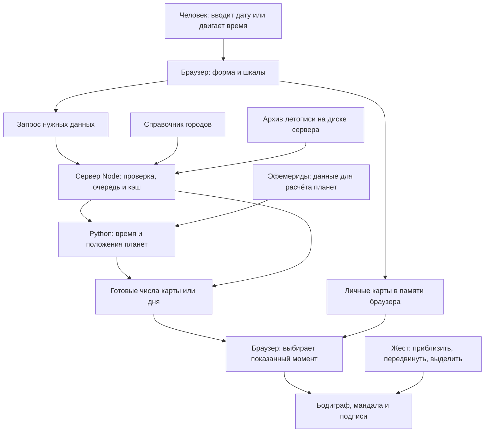
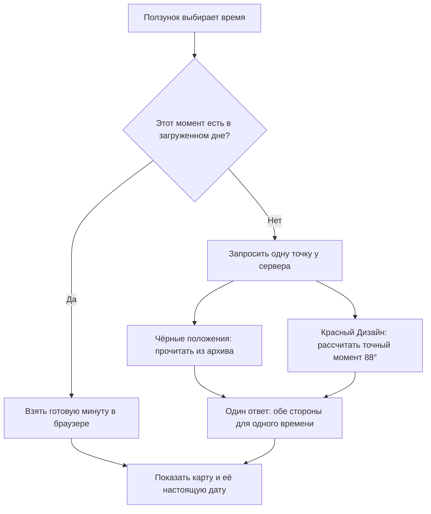

# Форма

«Форма» строит карту Human Design по дате, времени и городу рождения. Карту можно рассматривать как бодиграф или мандалу, приближать, выделять её части и исследовать изменения во времени.

## Содержание

- [Как работает приложение](#как-работает-приложение)
- [Действия пользователя](#действия-пользователя)
- [Структура проекта и назначение файлов](#структура-проекта)
- [Запуск](#запуск)
- [Проверки и поддержка](#проверки-и-поддержка)

## Как работает приложение

Браузер показывает карту. Сервер получает нужные данные. Python выполняет астрономический расчёт. Готовые числа возвращаются в браузер и становятся рисунком.



У приложения три независимые вещи:

- **Сохранённая карта** — исходные данные рождения в личной библиотеке.
- **Показанный момент** — сохранённая карта, текущий транзит или временный момент шкалы.
- **Вид рисунка** — масштаб, положение, подсветка и открытые панели.

Передвижение шкалы не переписывает сохранённую карту. Приближение рисунка не запускает астрономический расчёт.

## Действия пользователя

### Создание и открытие личной карты

Форма отправляет дату, местное время и выбранный город на сервер. Python переводит время в UTC — единое время расчёта — и получает положения планет. Сервер возвращает готовую карту; браузер сохраняет её в своей библиотеке и показывает. При открытии сохранённой карты повторный расчёт не нужен. В ручном режиме сохраняются введённые ворота без астрономического запроса.

За форму отвечает `views/birth-form.js`, за библиотеку — `data/chart-store.js` и `data/storage.js`, за выбор показанной карты — `state/chart-session.js`.

### Просмотр дня и летописи

**День** получает готовый пакет минут. Затем движение ползунка выбирает минуту в браузере. День рождения позволяет рассматривать другое время рождения, сохраняя исходную карту как точку возврата. Дневной транзит показывает выбранное время и умеет следовать за часами.

**Летопись, или «Годы»**, доступна в транзите. При открытии она использует уже загруженный сегодняшний день. Другой диапазон дат включает архив 1801–2399 с шагом десять минут. Конечная дата включается целиком.



Момент Дизайна находится по отставанию Солнца на **88 градусов**, а не на 88 дней. Он не округляется до соседней точки архива. Сервер проверяет, что архив и текущий расчёт используют одну версию движка.

В браузер приходит выбранная точка, а не весь архив. Пока новая точка загружается, видны прежняя карта и соответствующая ей дата. Запоздалый ответ закрытого просмотра не меняет экран.

Галочки выбирают видимые планеты. Они используют готовые положения и не пересчитывают астрономию. Выбор планет дня и годов согласован через `state/transit-planets.js`.

Летопись этой копии пока не подключена к личной карте и возвратам. Их объединение — отдельная работа.

### Выделение и сведения о карте

Нажатие выбирает ворота, канал, центр или планету. Наведение создаёт временную подсветку. Shift добавляет или убирает элементы общего выбора. Сведения и справочник читают готовые данные карты.

`selection/` хранит выбор; `views/` показывает сведения; `scene/updates.js` согласует их с рисунком.

### Приближение и движение рисунка

`scene/gestures.js` разбирает жест. `scene/camera.js` меняет сдвиг и масштаб. `scene/camera-view.js` применяет их к SVG. Геометрия карты при этом остаётся прежней.

При изменении времени отрисовщики обновляют существующие элементы SVG. Уже показанные числа и подписи не записываются в страницу повторно.

## Структура проекта

```text
форма/
├── public/              Страницы, стили и значок сайта
├── src/                 Всё, что работает в браузере
│   ├── startup.js       Начало загрузки
│   ├── app.js           Соединение частей приложения
│   ├── views/           Кнопки, формы, панели и подписи
│   ├── state/           Выбранная карта и исследуемое время
│   ├── data/            Запросы, библиотека и кэши браузера
│   ├── domain/          Правила и проверка данных карты
│   ├── selection/       Выбор и наведение
│   ├── scene/           Рисунок, камера и жесты
│   │   ├── geometry/    Формы и координаты
│   │   └── modes/       Состояние вида мандалы
│   ├── reference/       Справочные тексты
│   ├── ui/              Общие небольшие средства интерфейса
│   ├── diagnostics/     Измерение плавности
│   └── stories/         Отдельная страница «Сосуд любви»
├── server/              Всё, что работает на сервере
│   ├── server.mjs       Запуск и соединение серверных частей
│   ├── http/            Приём запросов и выдача файлов
│   ├── services/        Города, очереди расчёта и кэши
│   ├── runtime/         Управление процессами Python
│   ├── python/          Время, астрономия и подготовка архива
│   └── packets/         Упаковка и сжатие числовых данных
├── shared/              Форматы, общие для сервера и браузера
├── data/                Готовый справочник городов и эфемериды
├── scripts/             Сборка сайта и подготовка справочника
├── tests/               Проверки поведения и расчётов
├── .cache/              Получаемые заново данные; вне Git
├── dist/                Собранный сайт; вне Git
├── package.json         Команды и зависимости Node
├── requirements.txt     Закреплённые зависимости Python
├── THIRD_PARTY.md       Источники данных и лицензии
└── README.md            Эта карта устройства и запуска
```

Для изменения сначала найдите владельца нужного поведения:

| Нужно изменить | Начать здесь |
| --- | --- |
| Кнопку, панель или подпись | `public/index.html`, `public/styles.css`, нужный файл `src/views/` |
| Выбор карты или движение времени | `src/state/` |
| Получение и сохранение данных | `src/data/` |
| Правило карты | `src/domain/` |
| Форму рисунка | `src/scene/geometry/` |
| Размещение, масштаб или жесты | `src/scene/layout.js`, `camera.js`, `gestures.js` |
| Обновление рисунка | `src/scene/renderer.js` и соответствующий отрисовщик |
| Очередь или кэш сервера | `server/services/` |
| Точный астрономический расчёт | `server/python/astronomy.py` |
| Формат передаваемых чисел | `shared/` и `server/packets/` |

<details>
<summary><strong>Полная карта файлов: кто за что отвечает</strong></summary>

### Запуск и страницы

| Файл | Ответственность |
| --- | --- |
| `src/startup.js` | Сразу запрашивает день и начинает загрузку интерфейса. |
| `src/app.js` | Создаёт модули и соединяет их действия. |
| `public/index.html` | Элементы основной страницы. |
| `public/styles.css` | Внешний вид основной страницы. |
| `public/favicon.svg` | Значок сайта. |
| `public/love.html`, `public/love.css` | Отдельная страница «Сосуд любви» и её стиль. |
| `src/stories/vessel-of-love.js` | Поведение этой отдельной страницы. |

### Интерфейс: `src/views/`

| Файл | Ответственность |
| --- | --- |
| `birth-form.js` | Ввод рождения, поиск города и создание записи карты. |
| `library.js` | Меню, список личных карт и действия с ними. |
| `live-transit.js` | Соединение транзитного контроллера с навигацией страницы. |
| `transit-controls.js` | Ползунок транзита, дата и кнопка «Сейчас». |
| `natal-day-controls.js` | Ползунок дня рождения и возврат к исходному времени. |
| `lifetime-controls.js` | Поля диапазона летописи, ползунок и показанный момент. |
| `day-range.js` | Общее управление ползунком, включая захват пальцем. |
| `date-input.js` | Чтение и оформление введённой даты. |
| `date-picker.js` | Календарь: годы, месяцы, дни и перемещение фокуса. |
| `chart-display.js` | Название и подпись показанной карты. |
| `chart-heading-layout.js` | Размещение заголовка относительно рисунка и кнопок. |
| `chart-loading.js` | Состояния ожидания, готовности и повторной загрузки. |
| `activation-details.js` | Подготовка сведений об активации. |
| `activation-popover.js` | Подсказка у выбранной активации и её положение. |
| `chart-summary-data.js` | Подготовка сводки из готовых данных карты. |
| `chart-summary-panel.js` | Панель «О карте», поиск и выбор из сводки. |
| `knowledge.js` | Справочная библиотека и переходы по её материалам. |
| `thumbnail.js` | Маленький рисунок для карточки в библиотеке. |
| `camera-controls.js` | Соединение кнопок управления с камерой. |
| `performance-monitor.js` | Включение и отображение счётчика плавности. |

### Выбранные данные: `src/state/` и `src/data/`

| Файл | Ответственность |
| --- | --- |
| `state/chart-session.js` | Выбирает источник карты, которую сейчас показываем. |
| `state/live-transit.js` | Выбранная минута транзита, часы и смена дня. |
| `state/natal-day.js` | Временный просмотр дня рождения одной карты. |
| `state/lifetime.js` | Диапазон летописи, выбранная точка и переход между днём и архивом. |
| `state/transit-planets.js` | Выбор видимых планет дня и годов. |
| `data/api-client.js` | Запрос обычного расчёта и поиск городов. |
| `data/chart-store.js` | Набор личных карт и операции с ним. |
| `data/storage.js` | Чтение и запись библиотеки в хранилище браузера. |
| `data/transit-day-client.js` | Запрос и кэш готовых транзитных дней. |
| `data/natal-day-client.js` | Запрос готового дня рождения и кэш в памяти. |
| `data/natal-day-cache.js` | Хранение готовых дней рождения в IndexedDB. |
| `data/lifetime-client.js` | Запрос метаданных и отдельных точек летописи, отмена и кэш. |

### Правила карты: `src/domain/`

| Файл | Ответственность |
| --- | --- |
| `planets.js` | Порядок и обозначения планет. |
| `gate-wheel.js` | Перевод долготы в ворота и линию. |
| `substructure.js` | Цвет, тон и база активации. |
| `variables.js` | Четыре стрелки по данным активаций. |
| `topology.js` | Связи ворот, полные каналы и определённые центры. |
| `chart-facts.js` | Профиль и сводные сведения карты. |
| `line-fixing-data.js`, `line-fixing.js` | Таблица фиксаций линий и применение её правил. |
| `mandala-cross.js` | Четыре положения креста на мандале. |
| `transit-day.js` | Карта выбранной минуты транзита и проверка её индекса. |
| `natal-day.js` | Карта выбранной минуты дня рождения и проверка её индекса. |
| `day-timeline.js` | Подпись момента в нужном часовом поясе. |
| `lifetime.js` | Проверка точек летописи и карта с обеими сторонами. |

### Выбор: `src/selection/`

| Файл | Ответственность |
| --- | --- |
| `selection-state.js` | Обычный выбор и добавление через Shift. |
| `summary-selection-state.js` | Группы ворот, выбранные через сводку. |
| `selection-model.js` | Общий выбор, включая группы и закреплённые кресты. |
| `selection-targets.js` | Какие ворота относятся к выбранному объекту. |
| `hover-preview.js` | Временная подсветка при наведении. |

### Рисунок и движение: `src/scene/`

| Файл | Ответственность |
| --- | --- |
| `updates.js` | Согласует выбор, сведения и обновление рисунка. |
| `renderer.js` | Создаёт SVG и обновляет его существующие части. |
| `render-state.js` | Подготавливает данные для отрисовщиков. |
| `bodygraph-svg.js` | Создаёт SVG бодиграфа, включая статичные миниатюры. |
| `bodygraph-paint.js` | Общие решения о цвете и подсветке бодиграфа. |
| `bodygraph-painter.js` | Обновляет центры, каналы и ворота на месте. |
| `activation-columns.js`, `activation-painter.js` | Создание и обновление столбцов активаций. |
| `mandala.js`, `mandala-painter.js` | Создание и обновление кольца и планет. |
| `mandala-paint-rules.js` | Общие правила подсветки мандалы. |
| `mandala-preview.js`, `mandala-preview-painter.js` | Предпросмотр и обновление креста мандалы. |
| `backdrop.js` | Подложка основного рисунка. |
| `variable-arrows.js` | Рисунок стрелок переменных. |
| `loading-placeholder.js` | Заглушка из той же геометрии, что у готовой карты. |
| `svg-patches.js` | Общие операции обновления элементов SVG. |
| `gestures.js` | Различает нажатие, перетаскивание и приближение. |
| `camera.js` | Сдвиг, масштаб, границы движения и положение Home. |
| `camera-view.js` | Перевод координат и применение камеры к SVG. |
| `layout.js` | Расчёт размещения рисунка и доступного места. |
| `studio-controller.js` | Читает размеры страницы и применяет размещение. |
| `modes/mandala.js` | Переключение вида мандалы с сохранением положения. |
| `modes/mandala-motion.js` | Движение креста и соединение его с выбором. |

### Формы и координаты: `src/scene/geometry/`

| Файл | Ответственность |
| --- | --- |
| `chart-geometry.js` | Координаты и размеры центров, ворот и каналов. |
| `integration-geometry.js` | Общий узел интеграции и его кривые. |
| `drawing-geometry.js` | Собирает геометрию рисунка для потребителей. |
| `drawing-presentation.js` | Выбранное представление рисунка: общая основа карты и загрузочной заглушки. |
| `lotus-backdrop.js` | Контур человека в лотосе. |
| `activation-layout.js` | Координаты столбцов активаций. |
| `mandala-geometry.js` | Кольцо, секторы и круговая разметка. |
| `mandala-planets.js` | Планеты на кольце и их размещение без наложений. |
| `frames.js` | Область рисунка, которую должен вместить экран. |

### Остальные части браузера

| Файл | Ответственность |
| --- | --- |
| `src/reference/catalog.js` | Названия и справочные тексты элементов карты. |
| `src/ui/html.js` | Безопасное оформление HTML и общие операции с текстом. |
| `src/ui/toast.js` | Короткие сообщения пользователю. |
| `src/ui/telegram-gestures.js` | Согласование жестов с оболочкой Telegram. |
| `src/diagnostics/frame-monitor.js` | Измерение времени кадров. |

### Сервер и расчёт

| Файл | Ответственность |
| --- | --- |
| `server/server.mjs` | Читает настройки и запускает сервер. |
| `server/http/app.mjs` | Направляет каждый запрос нужному обработчику. |
| `server/http/transit-days.mjs` | HTTP-запрос дня транзита. |
| `server/http/natal-days.mjs` | HTTP-запрос личного дня рождения. |
| `server/http/lifetime.mjs` | Метаданные летописи и одна полная точка по индексу. |
| `server/http/public-files.mjs` | Разрешённые страницы, исходники и список файлов сборки. |
| `server/http/static-assets.mjs` | Выдача исходных и собранных файлов, сжатие и HTTP-кэш. |
| `server/http/content-encoding.mjs` | Выбор подходящего HTTP-сжатия. |
| `server/services/cities.mjs` | Поиск города и его часового пояса. |
| `server/services/calculate.mjs` | Обычный расчёт и общий предел расчётных процессов. |
| `server/services/transit-days.mjs` | Очередь, подготовка и дисковый кэш транзитных дней. |
| `server/services/natal-days.mjs` | Очередь и краткий кэш дней рождения. |
| `server/services/lifetime.mjs` | Проверка архива, чтение точки и соединение с точным Дизайном. |
| `server/runtime/json-worker.mjs` | Отдельный процесс Python: вход, ответ, ошибки и закрытие. |
| `server/runtime/calculator-workers.mjs` | Общий лимит процессов и повторное использование процесса Дизайна. |
| `server/python/calculator.py` | Сценарий расчёта одной карты или Дизайна. |
| `server/python/astronomy.py` | Swiss Ephemeris, долготы и поиск солнечной дуги 88°. |
| `server/python/civil_time.py` | Местное время, UTC, перевод часов и минутная сетка дня. |
| `server/python/chart_day.py` | Пакет всех минут дня рождения. |
| `server/python/transit_day.py` | Пакет всех минут транзита с обеими сторонами. |
| `server/python/design_worker.py` | Приём последовательных заданий Дизайна в одном процессе. |
| `server/python/lifetime_archive.py` | Одноразовая подготовка архива летописи. |
| `server/python/errors.py` | Общие ошибки расчёта. |
| `server/packets/encode.mjs`, `compression.mjs` | Упаковка точных чисел дня и сжатие ответа. |

### Общие данные, сборка и проверки

| Файл или каталог | Ответственность |
| --- | --- |
| `shared/day-packets/transit-format.js`, `natal-format.js` | Версии, порядок и состав пакетов дня. |
| `shared/day-packets/float64-codec.js`, `decode.js` | Запись, чтение и проверка Float64 без потери точности. |
| `shared/lifetime-format.js` | Планеты, версия и шаг архива летописи. |
| `data/cities.json` | Подготовленный справочник городов. |
| `data/ephe/` | Файлы эфемерид для Swiss Ephemeris. |
| `scripts/prepare-cities.py` | Подготовка справочника из исходных выгрузок GeoNames. |
| `scripts/build-web.mjs` | Сборка страниц и модулей в `dist/`, gzip и Brotli. |
| `tests/` | Проверки правил, интерфейса, HTTP и реальных расчётов. |
| `package-lock.json`, `requirements.txt` | Закреплённые версии зависимостей. |
| `.gitignore` | Исключение генерируемых данных и окружения из Git. |
| `THIRD_PARTY.md` | Происхождение сторонних данных и лицензии. |

</details>

## Запуск

Нужны **Node.js 24** и **Python 3.9+**. Все команды — из корня проекта; города и эфемериды уже включены.

### Первый запуск

```sh
python3 -m venv .venv
.venv/bin/pip install -r requirements.txt
npm ci
PORT=4176 npm start
```

Открыть [127.0.0.1:4176](http://127.0.0.1:4176). Без архива доступны карты и день; кнопка годов скрыта.

### Летопись

Подготовить архив один раз, затем запустить сайт с ним:

```sh
.venv/bin/python -m server.python.lifetime_archive \
  --file .cache/lifetime/lifetime-1801-2400.f64le --workers 3
FORMA_LIFETIME_CORPUS=.cache/lifetime/lifetime-1801-2400.f64le PORT=4176 npm start
```

Архив **1801–2399, 2,77 ГБ** и соседний `.metadata.json` остаются вне Git. При обычном запуске они не генерируются; готовые файлы используются повторно и не перезаписываются. Для существующего архива укажите его путь в `FORMA_LIFETIME_CORPUS`. Неверный архив останавливает запуск; `.env` автоматически не читается.

### Сборка

```sh
npm run build
PORT=4176 npm run start:release
```

`dist/` собирается из исходников и не входит в Git. Отправка кода в GitHub не обновляет публичный сервер.

## Проверки и поддержка

Проверки JavaScript и Python:

```sh
npm test
npm run test:python
```

Для HTTP-проверок сайт должен отдельно работать на 4176:

```sh
RUN_API_TESTS=1 API_TEST_BASE_URL=http://127.0.0.1:4176 npm test
```

Обычный день рассчитывается заранее. Летопись читает отдельные точки и хранит ограниченное число посещённых моментов: до 256 в браузере, до 1024 результатов Дизайна на сервере. Совпавшие запросы объединяются. Обычные карты и Дизайн делят предел в четыре процесса; готовый процесс Дизайна используется повторно и закрывается после 30 секунд простоя. Подготовка целых дней имеет собственные очереди.

Архив проверяется один раз при запуске, затем читается по нужным позициям. Геометрия, формат пакета и проверенный снимок данных имеют общих владельцев. Повторная запись неизменившегося текста и перестройка неизменившегося SVG пропускаются.

В Git сохраняются исходники, проверки, закреплённые зависимости, подготовленные города, эфемериды и эта документация. `.venv/`, `node_modules/`, `dist/`, кэши, логи и большие архивы исключены через `.gitignore`. Результаты экспериментов и временные копии не добавляются к исходникам приложения.

При изменении поведения обновляется его описание здесь. При переносе модуля обновляется карта файлов. Новая обязанность получает одного владельца; общие правила используются повторно. Ускорение подтверждается сравнением точности и измерением работы, а не только сокращением кода.
